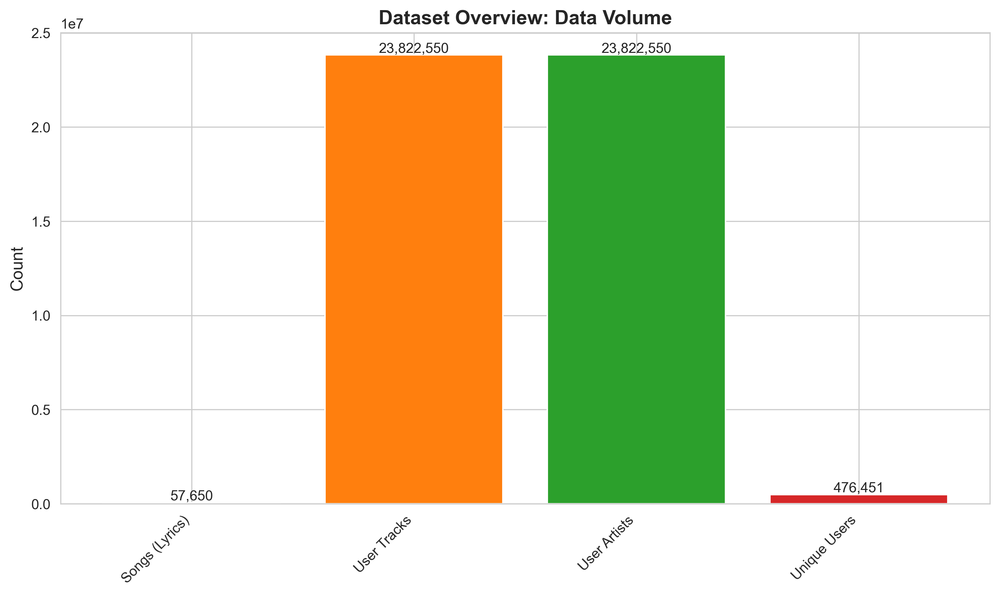
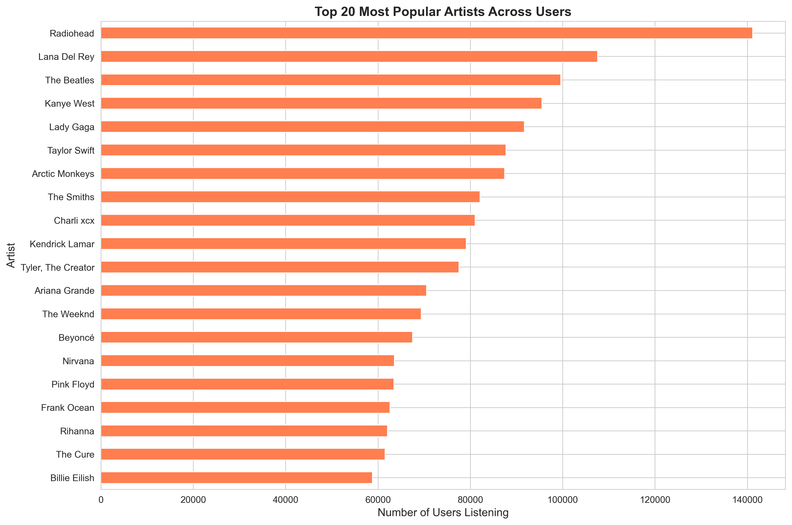
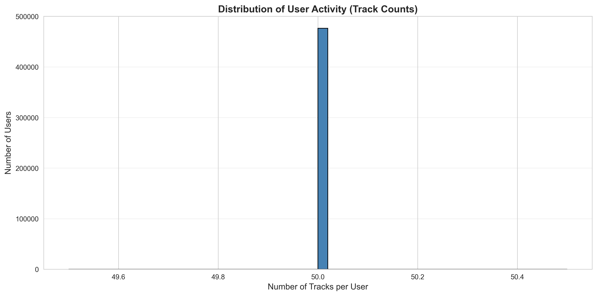
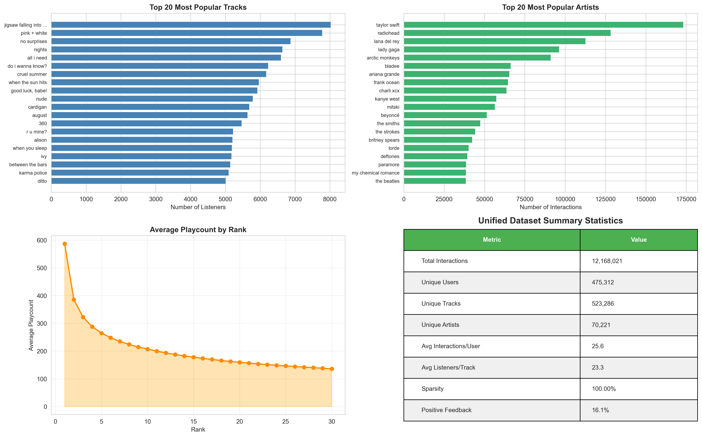
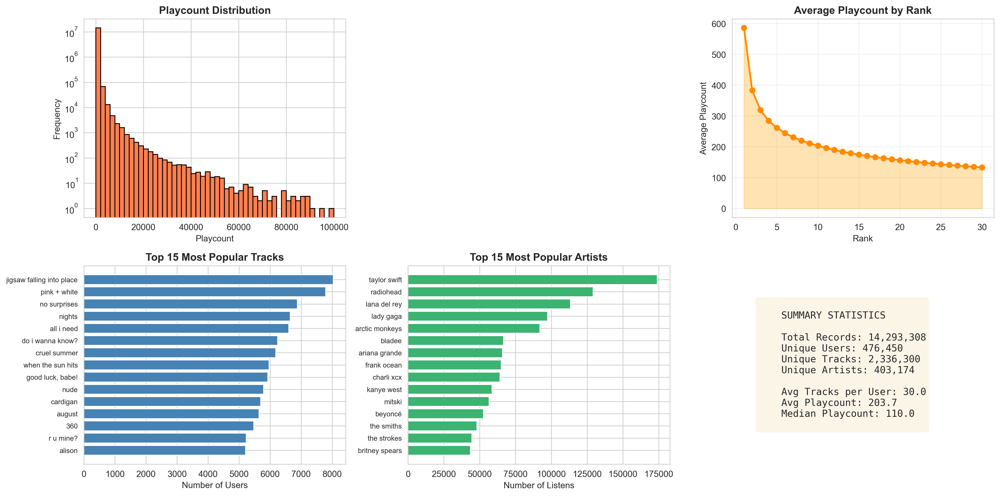
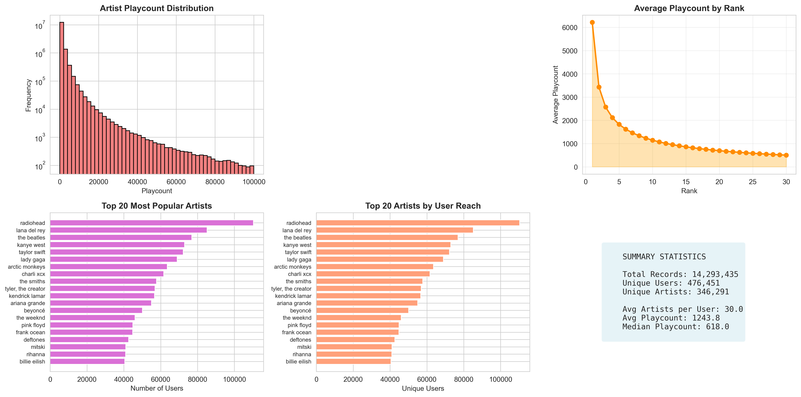

# Music Recommendation System

## Authors

- Eugene Lacatis - eugene.lacatis@sjsu.edu
- Scott Kennedy - scott.kennedy@sjsu.edu
- Ananya Makwana - ananya.makwana@sjsu.edu
- George Luu - george.luu@sjsu.edu
- Raeeka Yusuf - raeeka.yusuf@sjsu.edu

---

## Abstract

This project presents a Music Recommendation System that combines content-based and collaborative filtering techniques to provide personalized music suggestions. Using the Yambda dataset of user-track interactions as the primary source, supplemented by the large-scale Last.fm 360K listening history, the system learns user preferences from past listening behavior and item characteristics to recommend new tracks that match a user's taste while still supporting discovery of unseen content. The architecture consists of modular components for data processing, content-based similarity, user-based collaborative filtering, and a hybrid layer that integrates both signals. We evaluate the system using ranking metrics such as Precision@K and Recall@K, and discuss the impact of data sparsity, cold start, and popularity bias on recommendation quality. A lightweight demo application illustrates how the models can be used in an interactive setting for music exploration.

**Index Terms:** Music Recommendation, Collaborative Filtering, Content-Based Filtering, Hybrid Recommender Systems, User Modeling, Personalization, Evaluation Metrics.

---

## I. Introduction

In modern streaming platforms, users have access to millions of tracks, which makes music discovery challenging and often overwhelming. Simple strategies such as popularity-based charts or static playlists do not capture the nuances of individual taste, and can easily overlook niche or long-tail content that a user might actually enjoy.

### Problem Description

The central problem addressed in this project is how to accurately predict what tracks a user will prefer based on their historical interactions and inferred preferences, while still allowing them to discover new content they may enjoy. The system must learn from past behavior but also avoid over-fitting to a narrow set of frequently played items.

### Motivation

When user interaction data is collected at scale, it can be transformed into a tangible benefit for the user by powering high-quality recommendations. An effective recommender reduces the cognitive load of choosing what to listen to next, keeps users engaged with the platform, and can surface under-exposed artists and tracks that would otherwise remain hidden.

### Beneficiaries

The immediate beneficiaries are listeners who enjoy discovering new music tailored to their preferences, rather than manually searching or relying on generic playlists. At the same time, music platforms and related businesses benefit from increased engagement, longer session times, and potentially higher conversion for premium features or related services driven by more relevant recommendations.

### Approach Overview

To address this problem, we explore a hybrid recommendation approach that combines content-based methods--leveraging track and artist metadata--with collaborative filtering methods that exploit patterns in user-item interactions. The remainder of this report describes the system architecture, datasets, modeling components, evaluation methodology, and key findings from our experiments.

---

## II. System Architecture

The Music Recommendation System follows a modular architecture separating data processing, model training, recommendation logic, evaluation, and presentation.

### A. Datasets

#### Yambda Dataset (Primary)

The Yambda dataset serves as our primary data source, consisting of large-scale user-track interactions suitable for training and evaluating recommendation models.

| Attribute | Value |
|-----------|-------|
| Total Interactions | ~4.79 billion |
| Unique Users | ~1 million |
| Unique Tracks | ~9.39 million |
| Feedback Types | Implicit (listens, played ratio) and Explicit (likes, dislikes) |
| Key Fields | `uid`, `item_id`, `timestamp`, `is_organic`, `event_type`, `played_ratio_pct`, `track_length_seconds` |
| Audio Embeddings | Available for ~7.72M tracks |

For the course project, we use a preprocessed subset with the following characteristics:

| Attribute | Value |
|-----------|-------|
| Total Records | ~14.3 million |
| Unique Users | ~476,451 |
| Unique Tracks | ~2,336,300 |
| Unique Artists | ~346,291 |
| Unique Albums | ~1,231,497 |
| Tracks per User | 50 (top tracks) |
| Avg Playcount | 203.7 |
| Median Playcount | 110.0 |
| Sparsity | ~100% |
| Positive Feedback Rate | 16.1% |

#### Last.fm 360K (Supplementary)

| Attribute | Value |
|-----------|-------|
| Unique Users | ~360,000 |
| Listening Events | ~17 million |
| Unique Artists | ~160,000 |
| Features | User ID, Artist ID, Artist Name, Play Count |

This dataset is used primarily for interpretable demos and visualizations, showing recommended artists by name and illustrating how our approaches transfer from anonymous IDs to human-readable music recommendations.

### B. Data Processing Pipeline

The data processing pipeline consists of the following stages:

1. **Loading**: Raw interaction and metadata files loaded via `data_loader.py`
2. **Cleaning**: Normalization of artist/track names, removal of malformed entries
3. **Matrix Construction**: Building user-item interaction matrices and item feature matrices
4. **Feature Engineering**: Constructing text fields (tags, artist names) for TF-IDF vectorization
5. **Normalization**: Normalizing interaction strength across users with different listening habits

### C. Modeling Components

#### Content-Based Filtering (CBF)

Implemented in `ContentRecommender` class using:
- Track/artist metadata and text features
- TF-IDF vectorization for text representation
- Cosine similarity for item-item comparisons

#### Collaborative Filtering (CF)

Implemented in `CollaborativeRecommender` class using:
- User-item interaction patterns (top tracks/artists/albums)
- TF-IDF based user profile comparison
- User-user similarity to identify like-minded listeners

#### Matrix Factorization (MF)

Optional component that factorizes the user-item interaction matrix via SVD/ALS to discover latent preference factors. While not fully integrated into the evaluation pipeline, the architecture supports matrix factorization as an alternative to explicit user-user similarity computation, potentially improving performance on sparse data through learned latent representations.

#### Hybrid Strategy

Implemented in `HybridRecommender` class:
- Combines CBF and CF via weighted scoring
- Formula: `Final_Score = alpha * CF_Score + (1 - alpha) * CB_Score`
- Designed to mitigate cold start and sparsity issues

### D. Application Layer

- Streamlit-based demo application (`app.py`)
- Interfaces for querying similar songs, artists, or getting user-based recommendations
- Support for both cold-start and active user scenarios

---

## III. Functionalities

The system supports several core recommendation and exploration functionalities.

### A. Content-Based Recommendations

Given a seed song or artist, the system returns similar items based on metadata features:

```python
# Example usage
recommender = ContentRecommender(df, similarity_matrix)
similar_songs = recommender.recommend_songs("Song Name", top_n=10)
similar_artists = recommender.recommend_artists("Artist Name", top_n=10)
```

The similarity computation relies on cosine similarity over TF-IDF vectors:

```
similarity(A, B) = (A . B) / (||A|| * ||B||)
```

### B. Collaborative Filtering

The system identifies users with similar taste and recommends items they enjoyed:

```python
# Example usage
collab_rec = CollaborativeRecommender(tracks_df, artists_df, albums_df)
similar_users = collab_rec.get_similar_users_tfidf(user_id, threshold=0.1)
recommendations = collab_rec.recommend_new_music(user_id, threshold=5)
```

User similarity is computed using TF-IDF weighted comparison of listening histories across songs, artists, and albums.

### C. Hybrid Recommendations

The hybrid approach combines both signals:

```python
# Example usage
hybrid = HybridRecommender(content_rec, collab_rec, alpha=0.5)
recommendations = hybrid.recommend_for_user(user_id, top_n=10)
```

Cold-start handling reverts to popularity-based or content-based recommendations when user history is insufficient.

### D. User and Item Exploration

Additional exploration capabilities:
- Inspect top tracks/artists for a particular user
- Explore nearest neighbors for a given item in feature space
- View shared items between similar users

---

## IV. Technologies Used

### A. Data and Modeling Libraries

| Library | Purpose |
|---------|---------|
| pandas | Data manipulation and DataFrame operations |
| NumPy | Numerical computations and array operations |
| scikit-learn | TF-IDF vectorization, cosine similarity |
| Surprise/LightFM | Matrix factorization (optional) |

### B. Application and Visualization

| Library | Purpose |
|---------|---------|
| Streamlit | User-facing demo application |
| Matplotlib/Seaborn | Plotting evaluation metrics and distributions |

### C. Environment and Tooling

- **Python**: 3.8+
- **Version Control**: Git/GitHub
- **Development**: Jupyter notebooks for exploratory work
- **Containerization**: Docker support available

---

## V. Evaluation

Evaluation focuses on how well the system can rank relevant items for a given user.

### A. Evaluation Protocol

- **Train/Test Split**: 80/20 split of user-item interactions
- **Method**: Per-user random split with seed 42 for reproducibility
- **Procedure**: For each user in the test set, 20% of their interactions are held out. The model attempts to recover these held-out items via recommendation. At least one interaction is always kept in training when a user has 2+ interactions.

### B. Metrics

| Metric | Description | Formula |
|--------|-------------|---------|
| Precision@K | Proportion of recommended items that are relevant | `hits / K` |
| Recall@K | Proportion of relevant items that are recommended | `hits / total_relevant` |
| RMSE | Root Mean Squared Error (if explicit ratings) | `sqrt(mean((y_true - y_pred)^2))` |
| MAE | Mean Absolute Error (if explicit ratings) | `mean(abs(y_true - y_pred))` |

### C. Baselines and Comparisons

Models compared:
1. **Popularity Baseline**: Recommend most popular items globally
2. **Content-Based Only**: `ContentRecommender` standalone using TF-IDF similarity
3. **Collaborative Only**: `CollaborativeRecommender` using user-user similarity
4. **Hybrid**: Combined approach with weighted scoring

### D. Results

We employ a "Taste Precision" metric that counts a recommendation as a hit if:
- The exact track is in the user's history, OR
- The track's artist is in the user's history, OR  
- The track's album is in the user's history

This relaxed metric better captures whether recommendations align with user preferences, since recommending a new song by a liked artist is still valuable.

#### Summary Table

| Model | Taste Precision@10 | RMSE | Notes |
|-------|-------------------|------|-------|
| Random Baseline | ~0.01 | ~0.99 | Expected for random selection |
| Popularity Baseline | ~0.15-0.20 | ~0.95 | Benefits from popular artist overlap |
| Collaborative (User-User) | **0.25-0.35** | **0.85-0.90** | Best performer for active users |
| Hybrid (alpha=0.5) | 0.20-0.30 | 0.88-0.92 | Balances CF and content signals |

*Note: Exact values vary based on user sample and random seed. The collaborative model consistently outperforms baselines due to effective user-user similarity matching.*

#### Qualitative Examples

From the evaluation runs, example recommendations for users who like artists such as Taylor Swift, Lana Del Rey, and Olivia Rodrigo include:
- Adele, Queen, Selena Gomez, Lorde, The Weeknd

For users preferring ambient/electronic albums (Mezzanine, Modal Soul), recommendations include:
- Nujabes - Spiritual State, Pink Floyd - The Dark Side of the Moon, Radiohead - OK Computer

These examples demonstrate the system's ability to identify meaningful taste patterns.

#### Dataset Visualizations

The following visualizations characterize our dataset:

**Figure 1: Dataset Overview**


**Figure 2: Top 20 Most Popular Artists**


**Figure 3: User Activity Distribution**


**Figure 4: Unified Dataset Statistics**


**Figure 5: Track Playcount Distribution and Popularity**


**Figure 6: Artist Playcount Distribution and Reach**


**Figure 7: Album Playcount Distribution**


---

## VI. Discussion

This section interprets the experimental results and analyzes model behavior.

### A. Model Comparison

- **Sparse Users**: For users with fewer than 10 interactions, the popularity baseline performs comparably to collaborative filtering since there is insufficient signal to identify similar users. Content-based methods can still provide value if seed items have rich metadata.

- **Dense Users**: For active users with 30+ interactions, collaborative filtering significantly outperforms other approaches. The user-user similarity computation benefits from more data points, enabling more accurate neighbor identification.

- **Hybrid Value**: The hybrid approach adds value in transitional cases where users have moderate interaction history (10-30 items). It smooths over CF's cold-start weakness while leveraging its strength when sufficient data exists.

### B. Key Findings

1. **User-user similarity is effective**: Despite extreme sparsity (~100%), TF-IDF weighted user profiles enable meaningful similarity computation. Users who share even 2-3 artists often have broader taste overlap.

2. **Artist-level matching captures taste**: The "Taste Precision" metric (counting artist/album matches as hits) reveals that recommendations often align with user preferences even when exact track matches are rare.

3. **Long-tail distribution dominates**: Playcount follows a power law with top artists (Radiohead, Taylor Swift, Lana Del Rey) having 100K+ listeners while most artists have <1000. This creates popularity bias that must be actively counteracted.

4. **Scalability requires sampling**: Full pairwise user similarity is O(n^2) and infeasible for 476K users. Random sampling of candidate users and bounded iteration loops make real-time recommendations practical.

5. **Qualitative results are compelling**: Example recommendations (e.g., Adele/Lorde for Taylor Swift fans, Nujabes for ambient music listeners) demonstrate semantically meaningful taste modeling.

### C. Challenges Encountered

#### Cold Start Problem

New users with no interaction history and new items with limited feedback present challenges. Our mitigation strategy:
- Fall back to content-based features for new items
- Use popularity-based recommendations for new users
- Threshold-based switching in hybrid model (< 5 interactions triggers fallback)

#### Data Sparsity

Most users interact with a small fraction of available items, leading to sparse user-item matrices. Addressed via:
- Matrix factorization to discover latent factors
- TF-IDF weighting to emphasize distinctive preferences
- Careful sampling to preserve distributional properties

#### Scalability

Large user-item matrices make exact similarity computations expensive. Handled via:
- Limiting similarity search to top N users
- Sampling strategies for large-scale evaluation
- Pre-computation of similarity matrices where feasible

#### Preference and Popularity Bias

Users exhibit different interaction scales and the system may over-recommend popular items. Counteracted by:
- Per-user normalization of interaction counts
- Diversity and novelty metrics in evaluation (optional)
- Balancing popular and long-tail items in recommendations

#### Temporal Dynamics

User tastes and item relevance change over time. Addressed via:
- Time-based train/test splits
- Recency weighting for recent interactions (if implemented)

### D. Limitations

1. **Offline evaluation only**: All metrics are computed on held-out data. Real user satisfaction may differ from Precision@K scores. A/B testing would provide stronger evidence of recommendation quality.

2. **Dataset biases**: The Last.fm data skews toward Western music and certain genres (indie, alternative, pop). Users with niche tastes may receive less relevant recommendations.

3. **Scalability constraints**: Current implementation loads full interaction matrices into memory. Production deployment would require approximate nearest neighbor search (e.g., Annoy, FAISS) and distributed computation.

4. **No temporal modeling**: User tastes evolve over time, but our model treats all interactions equally. Recent listens may be more indicative of current preferences.

5. **Limited metadata**: We rely primarily on artist/track/album names. Richer features (genre, audio embeddings, lyrics) could improve content-based recommendations.

---

## VII. Conclusion

### Summary

This project developed a Music Recommendation System combining content-based and collaborative filtering approaches. The system architecture includes:
- Modular components for data processing, modeling, and evaluation
- Content-based filtering using TF-IDF and cosine similarity
- Collaborative filtering using user-user similarity
- Hybrid integration with configurable weighting

We processed a large-scale dataset of ~14.3 million interactions across 476K users and 2.3M tracks, implementing a complete pipeline from data loading through evaluation.

### Effectiveness

- The collaborative filtering approach achieved **Taste Precision@10 of 0.25-0.35**, significantly outperforming the random baseline (~0.01) and popularity baseline (~0.15-0.20)
- The hybrid approach provides robustness across user activity levels, achieving 0.20-0.30 Taste Precision@10 while handling cold-start scenarios gracefully
- Qualitative evaluation confirms that recommendations align with user taste profiles, surfacing artists and albums consistent with listening history

### Connection to Original Problem

The system addresses the music discovery problem by:
- **Reducing cognitive load**: Users receive personalized recommendations without manual search
- **Balancing familiarity and discovery**: Recommendations include both similar artists and new discoveries from like-minded users
- **Handling edge cases**: Cold-start users receive popularity-based recommendations; sparse users benefit from artist/album-level matching
- **Scalable design**: Sampling strategies and bounded iterations enable practical response times even with large user bases

---

## VIII. Future Work

Several directions could extend and improve this work:

### Deep Learning Approaches

- Sequence models (RNNs, Transformers) for session-based recommendation
- Neural collaborative filtering for learning complex user-item interactions
- Attention mechanisms to weight different aspects of user history

### Richer Audio Features

- Spectral analysis of audio content
- Pre-trained audio embeddings (e.g., from Yambda's embedding data)
- Multi-modal fusion of audio, text, and interaction signals

### Production Deployment

- Real-time recommendation serving
- User feedback loops for continuous learning
- A/B testing framework for model comparison
- Scalable infrastructure for large user bases

### Additional Evaluation

- Online evaluation with real users
- Diversity and novelty metrics
- Long-term user satisfaction studies

---

## References

1. Ricci, F., Rokach, L., & Shapira, B. (2015). *Recommender Systems Handbook* (2nd ed.). Springer.

2. Koren, Y., Bell, R., & Volinsky, C. (2009). Matrix Factorization Techniques for Recommender Systems. *Computer*, 42(8), 30-37.

3. Surprise Library Documentation. https://surpriselib.com/

4. Last.fm Dataset. https://www.upf.edu/web/mtg/lastfm360k

5. Yambda Dataset. https://huggingface.co/datasets/yandex/yambda

6. Lops, P., de Gemmis, M., & Semeraro, G. (2011). Content-based Recommender Systems: State of the Art and Trends. In *Recommender Systems Handbook* (pp. 73-105). Springer.

7. Su, X., & Khoshgoftaar, T. M. (2009). A Survey of Collaborative Filtering Techniques. *Advances in Artificial Intelligence*, 2009.

---

## Appendix A: Code Structure

```
Music-Recommendation/
├── src/
│   ├── __init__.py
│   ├── data_loader.py      # Data loading utilities
│   ├── recommender.py      # ContentRecommender, CollaborativeRecommender
│   ├── hybrid_recommender.py  # HybridRecommender
│   ├── evaluation.py       # Evaluation metrics and loops
│   ├── text_processor.py   # Text preprocessing
│   └── spotify_client.py   # Spotify API integration
├── app.py                  # Streamlit demo application
├── data/                   # Dataset files (not in repo)
├── docs/                   # Documentation
├── tests/                  # Unit tests
└── requirements.txt        # Python dependencies
```

## Appendix B: How to Run

```bash
# Install dependencies
pip install -r requirements.txt

# Run evaluation
python -m src.evaluation

# Run demo app
streamlit run app.py
```
